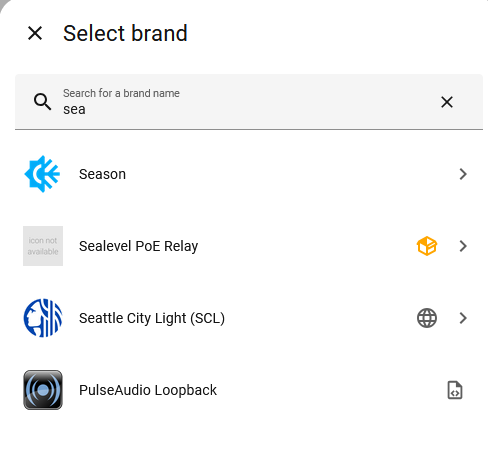
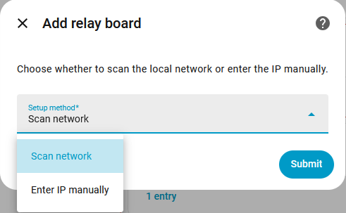
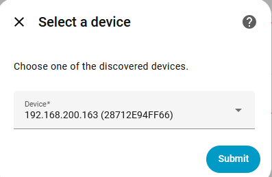
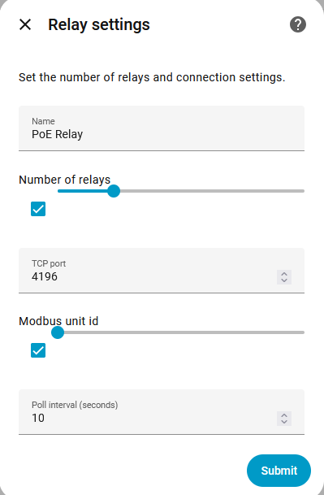
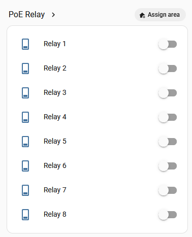

ChatGPT Chat:  
https://chatgpt.com/c/69ae2d7f-d41c-832d-a1f5-428c1633185e


I think this is the wrong directory....  
`sudo unzip ~/sealevel_poe_relay_integration.zip -d /srv/homeassistant/custom_components/`

`docker restart homeassistant`

```
root@homeassistant21:/# cat /srv/homeassistant/home-assistant.log | grep sea
2026-03-08 22:55:12.038 WARNING (SyncWorker_0) [homeassistant.loader] We found a custom integration sealevel_poe_relay which has not been tested by Home Assistant. This component might cause stability problems, be sure to disable it if you experience issues with Home Assistant
```









