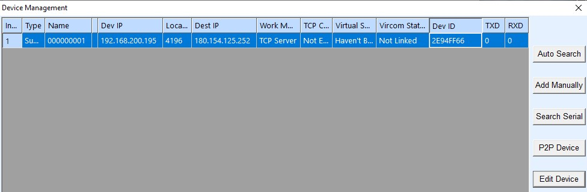
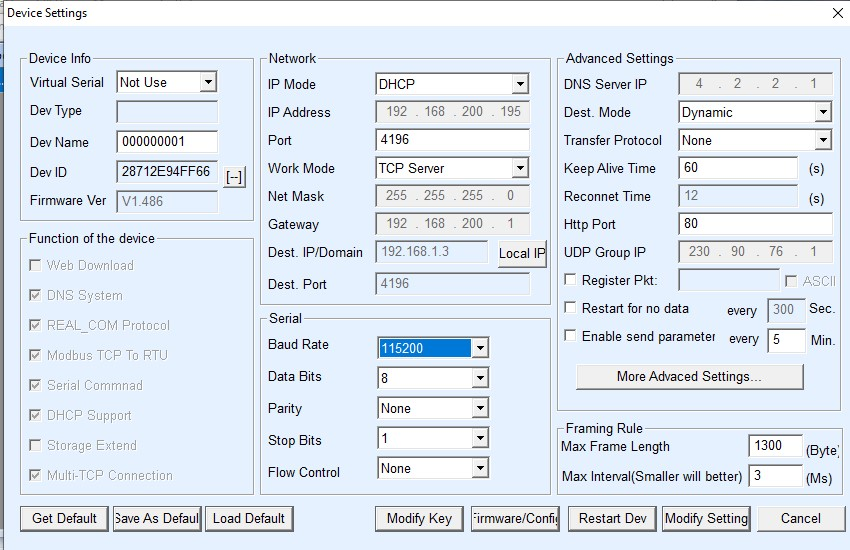

# modbus_relay
modbus_relay is a project which controls an ethernet Waveshare Modbus POE ETH Relay Module  
https://www.waveshare.com/modbus-poe-eth-relay.htm

modbus_relay listens on a FIFO pipe and when data is received, it will puse Relay 1 for 200 ms. This is used in conjunction with Home Assistant to actuate a 24VAC home doorbell chime.  It is designed to run in either daemon mode (default) or in console. It runs in a non-blocking loop and has 

The program creates and listens on the following FIFO pipe:  
  `/usr/share/hassio/homeassistant/pipes/host_executor_queue`

When the program is running, you can send commands to the:  
  `echo 123 >  /usr/share/hassio/homeassistant/pipes/host_executor_queue`

# Configuration of the Waveshare Modbus Relay Module
Device Information: https://www.waveshare.com/modbus-poe-eth-relay.htm  
Cost is roughly $50 on Amazon.

The WIKI is a good start to understanding how to manage the relay board device. There is a link to two Windows applications - Vircom and Sscom.

Vircom is used to find and configure the relay board. The relay board comes with a default static IP address of 192.168.1.200/24. There is no need to reconfigure your host to be on the 192.168.1.x network, ad the Vircom software can find the relay board through UDP broadcast messages as seen int he Vircom Device Manager:

Using the `Edit Device` button allows you to configure the network. Address the device as appropriate for your network (a static IP address is not required for this application). The important parts to configure for this application are:
- Port: 4196
- Work Mode: TCP Server

# Installation
- Install ruby  
`sudo apt install ruby`

- Install gems  
`sudo gem install ....`

# Usage

